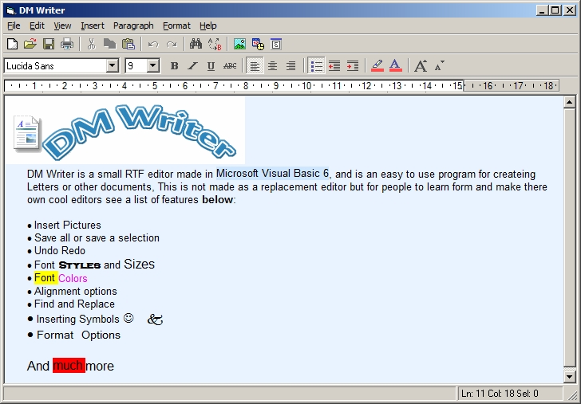

## DM Writer

### Description

DM Writer is an RTF Editor I been working on for the last two days, it comes with most of the features in wordpad and more, Please note this is the first version and I hope to add more cool things next time, so far it has most of the edit options, save, save selection, Text colors and styles, Highlight text, Insert symbols, Find and Replace, Goto options and much more hope you find the code usfull, many comments included. Please vote if you find this code usfull.
 
### More Info
 

             |
---                |---
**Submitted On**   |2009-07-25 18:08:50
**By**             |[dreamvb](https://github.com/Planet-Source-Code/PSCIndex/blob/master/ByAuthor/dreamvb.md)
**Level**          |Beginner
**User Rating**    |4.8 (29 globes from 6 users)
**Compatibility**  |VB 6\.0
**Category**       |[Complete Applications](https://github.com/Planet-Source-Code/PSCIndex/blob/master/ByCategory/complete-applications__1-27.md)
**World**          |[Visual Basic](https://github.com/Planet-Source-Code/PSCIndex/blob/master/ByWorld/visual-basic.md)
**Archive File**   |[DM\_Writer2158507262009\.zip](https://github.com/Planet-Source-Code/dreamvb-dm-writer__1-72307/archive/master.zip)

